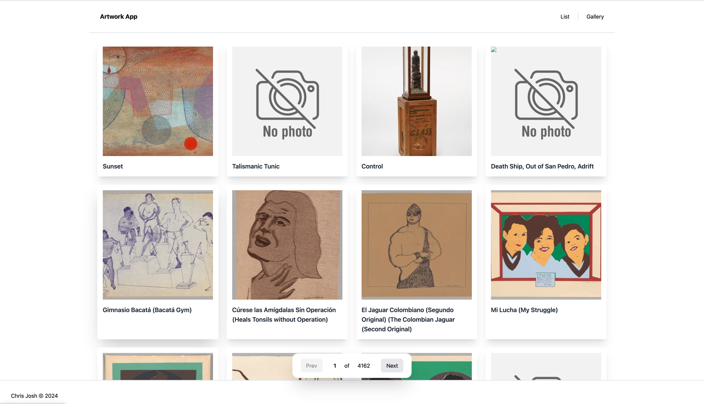
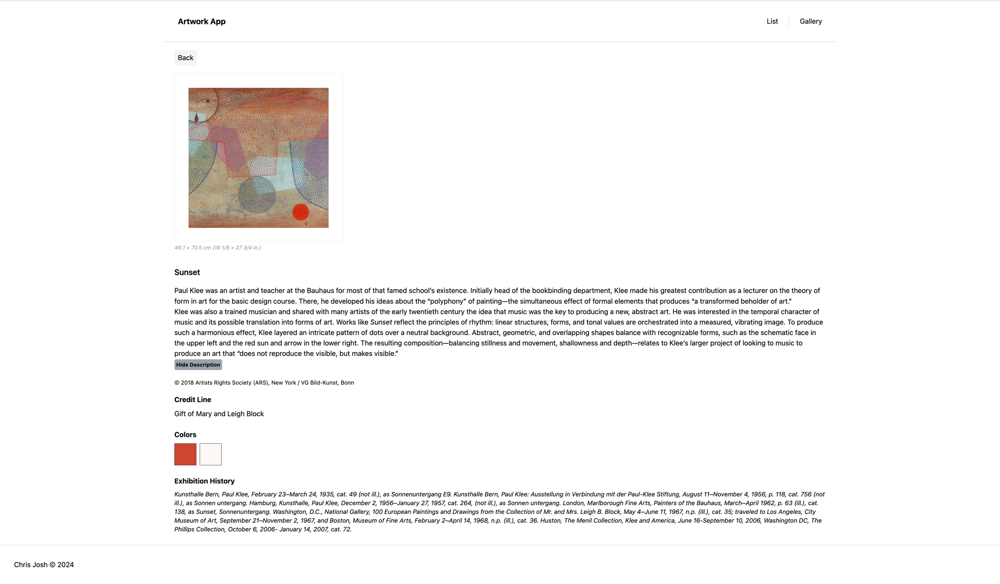

### What we’re looking fo

-[x] Do you know how Next.js works, including the app directory and data fetching?  
-[x] Can you build a responsive design using Tailwind CSS that works across all screen resolutions?  
-[x] Can you work effectively with a JSON response from an API?  
-[x] Can you add interactivity to the client using React?

### Requirements

#### Home Page

- The homepage should display all available artwork
- Each piece of artwork on the homepage should display a **title** and an **image**
- Each piece of artwork on the homepage should link to an individual artwork page

#### Artwork Page

- Each piece of artwork should be available on a unique URL, e.g. _`/artwok/[id]`_
- The artwork page should display the **title** and **image** of the artwork
- The artwork page should contain a **description** that is hidden by default, but can be made visible by clicking something

### Project setup

- create your .env file
- copy the content from .env.example to .env

#### Project Remark
Landing

View

it is an interesting project, what i would have done differently if I had
more time on my side

- infinite scroll on the homepage (list view) using intersection observer api
- better image loading experience
- better implementation of broken image link fallback image (funny hack there)
- better app loading experience

Note: I have not reviewed this code due to my limited time
